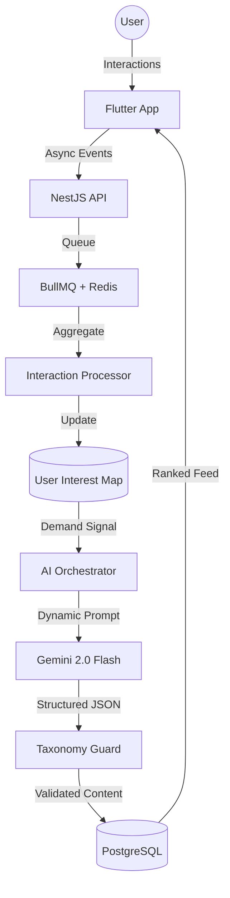

# 🌠 Lattice: Adaptive Educational Ecosystem

[](https://opensource.org/licenses/MIT)
[](https://nestjs.com/)
[](https://flutter.dev/)
[](https://deepmind.google/technologies/gemini/)

Lattice is a "Closed Loop" adaptive learning platform that uses real-time user interactions to steer AI content generation. It combines a high-fidelity **Celestial Sapphire** mobile experience with a robust, event-driven backend to create a truly personalized educational journey.

---

## 🏗️ Architecture Overview

Lattice is built on a "Signal-Response" cycle where user behavior directly informs the content engine.



---

## ✨ Key Features

### 🧠 Adaptive Ranking Engine
Lattice doesn't just show you content; it learns what you struggle with. 
- **Engagement Scoring**: A deterministic formula weighing `helpful` vs `challenging` interactions.
- **Skill Gaps**: Content you mark as "Challenging" is prioritized for the next automated generation cycle.
- **Recency Bias**: Ensures the feed stays fresh while respecting your learning pace.

### 🌌 Celestial Sapphire UI
A "God-Tier" mobile interface designed for deep focus and premium feel.
- **Procedural Starfields**: Real-time starry backgrounds that change as you scroll.
- **Glassmorphism 2.0**: Heavy backdrop blurs and frosted glass surfaces.
- **Neon Glows**: Dynamic Indigo and Magenta glowing borders that react to card state.

### 🛡️ Taxonomy Guard ("Sanity First")
Every piece of AI-generated content passes through a strict validation layer to ensure:
- **Category Integrity**: Prevents AI "hallucinations" of non-existent topics.
- **Tag Hygiene**: Standardizes metadata for consistent ranking.
- **Smart Fallback**: Automatically switches to high-fidelity mock templates if AI quotas are reached, ensuring zero downtime.

---

## 🚀 Getting Started

### 📦 Prerequisites
- **Docker & Docker Compose**
- **Flutter SDK** (3.x recommended)
- **Node.js** (v18+)
- **Gemini API Key** (from [Google AI Studio](https://aistudio.google.com/))

### 🛠️ Backend Setup
1. Navigate to `backend/`
2. Create `.env` file from the provided template:
   ```env
   DB_HOST=localhost
   DB_PORT=5436
   GEMINI_API_KEY=your_key_here
   REDIS_HOST=localhost
   ```
3. Boot services:
   ```bash
   docker-compose up -d
   npm install
   npm run start:dev
   ```

### 📱 Mobile Setup
1. Navigate to `mobile/`
2. Update `AppConstants.backendUrl` in `lib/core/constants.dart` with your machine's IP.
3. Run the app:
   ```bash
   flutter pub get
   flutter run
   ```

---

## 👨‍💻 Contributing

We welcome contributions to the Lattice ecosystem! Please refer to our [CONTRIBUTING.md](docs/CONTRIBUTING.md) for guidelines.

## 📄 License

This project is licensed under the MIT License - see the [LICENSE](LICENSE) file for details.

## 🆘 Support

If you encounter issues or have questions:
- Open a GitHub Issue.
- Check the [Project Walkthrough](file:///home/calm/.gemini/antigravity/brain/a6af4898-5fa0-4bae-9e0e-a608c25b16bb/walkthrough.md) for deep technical details.

---
*Built with ❤️ by the Lattice Team.*
