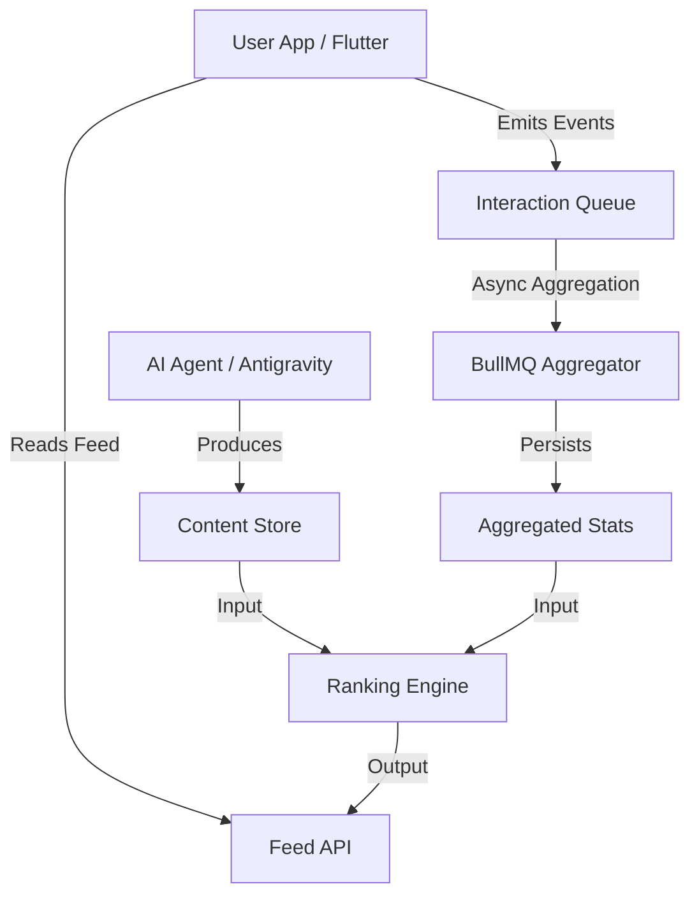

# Lattice: Adaptive Educational Platform

A backend-orchestrated educational feed system where AI generates structured content, curated through explainable, interest-driven ranking and interaction feedback.

## Core Principle

AI is used to **produce bounded, typed educational content units**, not to control ranking, personalization, or real-time feed decisions.

## System Architecture



## Content Schema Example

```json
{
  "id": "uuid-v4",
  "category": "software_engineering",
  "subcategories": ["backend", "distributed_systems"],
  "tags": ["nest-js", "redis"],
  "difficulty": "intermediate",
  "type": "concept",
  "body": "# NestJS Microservices...",
  "status": "active",
  "expectedReadTimeSec": 180,
  "aiMetadata": {
    "prompt_version": "v2.1",
    "model_version": "gemini-2.0-flash",
    "timestamp": "2026-02-02T10:20:29Z"
  }
}
```

## Ranking Logic

The feed is constructed using a deterministic, explainable ranking formula:

```text
score = 0.35 * interest_weight   // matches user preference
      + 0.25 * engagement_score  // pre-aggregated interaction signals
      + 0.20 * recency_decay     // promotes fresh content
      + 0.10 * difficulty_match  // aligns with inferred user level
      - 0.10 * diversity_penalty // reduces repeated subcategory dominance
```

*All components are normalized to `[0,1]`. Final score is clipped to `[0,1]`.*

## Design Decisions

1. **AI as Infrastructure**: AI is a bounded producer, not a real-time decision maker.
2. **Deterministic Ranking**: Ensures explainability and debuggability.
3. **Async Aggregation**: Interaction weights are updated gradually to avoid overfitting and control compute costs.
4. **State Management**: Fully backend-owned state for auditable user profiles.
